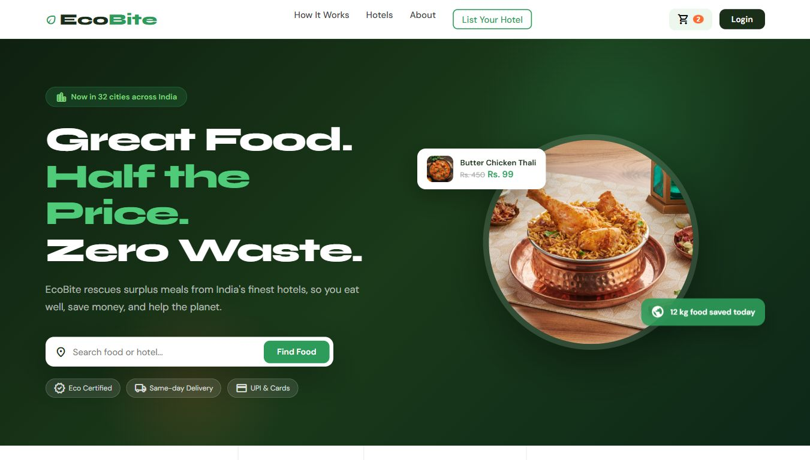
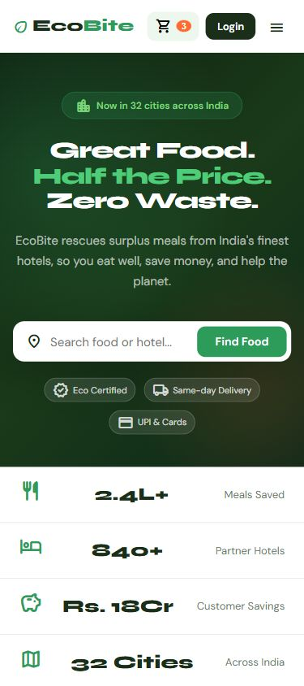

# EcoBite

EcoBite is a frontend food-rescue and home-delivery web app inspired by modern food delivery platforms. It helps users browse surplus meals from partner hotels, add discounted dishes to cart, and complete a delivery-style checkout flow.

## Screenshots

### Desktop


### Mobile


## Features

- Responsive landing page for desktop, tablet, and mobile screens
- Food listings written directly in HTML for easy editing
- Dish images loaded from the local `FOOD IMAGES` folder
- City, category, and search filtering with JavaScript
- Add-to-cart flow using browser localStorage
- Cart page with quantity controls, coupon support, delivery form, payment options, and order success modal
- Hotel partner dashboard with listings, orders, and settings UI
- Login/signup page with user and hotel partner modes
- Mappls MapmyIndia SDK integration with Leaflet fallback for local/demo safety

## Tech Stack

- HTML5
- CSS3
- JavaScript
- Mappls MapmyIndia Web JS SDK
- Leaflet fallback map
- Google Fonts and Material Symbols

## How To Run

1. Download or clone this repository.
2. Keep the folder structure unchanged:
   - `EcoBite.html`
   - `cart.html`
   - `login.html`
   - `dashboard.html`
   - `CSS/`
   - `JS/`
   - `FOOD IMAGES/`
3. Open `EcoBite.html` directly in a browser.

For the best local preview, run a simple server from the project folder:

```bash
python -m http.server 8080
```

Then open:

```text
http://127.0.0.1:8080/EcoBite.html
```
```text
EcoBite/
  EcoBite.html
  cart.html
  login.html
  dashboard.html
  CSS/
    EcoBite.css
    cart.css
    login.css
    dashboard.css
  JS/
    ECOBITE.js
    cart.js
    firebase-config.js
    firebase-seed.js
    firebase-service.js
    login.js
    dashboard.js
  firestore.rules
  storage.rules
  firebase.json
  FOOD IMAGES/
    butterchickhen.jpg.jpeg
    chickenbiryani.jpg.jpeg
    dm.jpg.jpeg
    pbm.jpg.jpeg
    rajma.jpg.jpeg
  screenshots/
    home-desktop.png
    home-mobile.png
```

## Notes

Payments are still simulated in the UI. For real money movement, connect a payment gateway such as Razorpay or Stripe through a trusted server or Firebase Cloud Functions.
